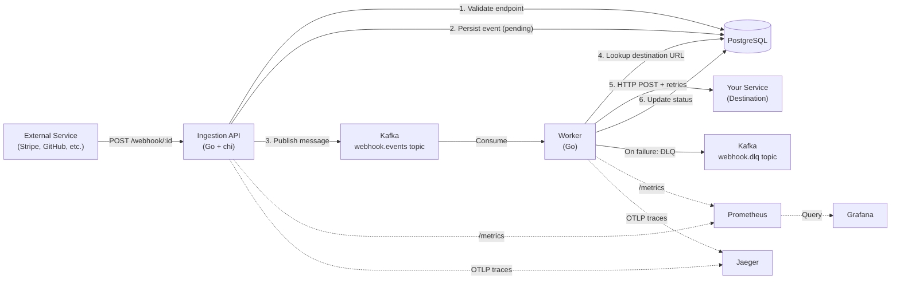

# 🪝 Hook Observer

A production-grade **Webhook Ingestion and Forwarding System** built with Go, Kafka, PostgreSQL, and Kubernetes. Designed to reliably receive, persist, and deliver webhooks to downstream services with automatic retries, dead-letter queuing, and full observability.

## Architecture



## Why Kafka?

Kafka acts as a **durable, ordered message queue** between the Ingestion API and the Worker. This decoupling is the core architectural decision — here's why:

- **Durability**: If the Worker crashes, messages are not lost. They sit safely in the Kafka topic until the Worker recovers.
- **Speed**: The Ingestion API responds to the sender in milliseconds (202 Accepted) without waiting for the slow HTTP delivery to happen.
- **Backpressure**: If the destination service is slow, Kafka buffers the messages. The Worker processes at its own pace without overwhelming the destination.
- **Replay**: Failed events (in the DLQ) can be replayed from the dashboard without any data loss.

## Why Kubernetes?

- **Self-healing**: If the Worker pod crashes, Kubernetes automatically restarts it. Events are buffered in Kafka, so nothing is lost.
- **Autoscaling**: The Ingestion API has an HPA configured to scale from 1 to 5 replicas under CPU load, handling traffic spikes automatically.
- **Declarative infrastructure**: The entire system is described in YAML files. Deploying to a new cluster is a single `kubectl apply -f k8s/` command.

## Tech Stack

| Component | Technology | Role |
|---|---|---|
| Ingestion API | Go + chi | Receives webhooks, validates, stores, publishes to Kafka |
| Worker | Go | Consumes from Kafka, forwards events with retries + backoff |
| Message Broker | Apache Kafka (KRaft mode) | Decoupled, durable event queue |
| Database | PostgreSQL 16 | Persistent store for endpoints and event history |
| Dashboard | React + Vite + Nginx | UI for viewing and replaying events |
| Metrics | Prometheus + Grafana | Request rates, delivery success, retry counts, latency |
| Tracing | OpenTelemetry + Jaeger | End-to-end distributed traces across API → Kafka → Worker |
| Orchestration | Kubernetes (Kind for local) | Self-healing, autoscaling, declarative deployments |
| Package Manager | Helm | Installs Kafka into Kubernetes from Bitnami charts |

---

## Local Development (Docker Compose)

The fastest way to run the entire stack locally.

### Prerequisites
- [Docker Desktop](https://www.docker.com/products/docker-desktop/)

### Start everything

```bash
docker-compose up --build
```

### Access the services

| Service | URL | Credentials |
|---|---|---|
| React Dashboard | http://localhost:3000 | — |
| Ingestion API | http://localhost:8080 | — |
| Grafana | http://localhost:3001 | admin / admin |
| Prometheus | http://localhost:9090 | — |
| Jaeger UI | http://localhost:16686 | — |

### Send a test webhook

```bash
curl -X POST http://localhost:8080/webhook/test-endpoint \
  -H "Content-Type: application/json" \
  -d '{"event": "payment.success", "amount": 9900, "currency": "usd"}'
```

Watch the event appear in the Dashboard at `http://localhost:3000`, and the trace appear in Jaeger at `http://localhost:16686` (search for service `ingestion-api`).

---

## Kubernetes Deployment (Kind)

### Prerequisites
- [Docker Desktop](https://www.docker.com/products/docker-desktop/)
- [kind](https://kind.sigs.k8s.io/)
- [kubectl](https://kubernetes.io/docs/tasks/tools/)
- [Helm](https://helm.sh/)

### 1. Create a Kind cluster

```bash
kind create cluster
```

### 2. Install Kafka via Helm

```bash
helm repo add bitnami https://charts.bitnami.com/bitnami
helm install kafka bitnami/kafka --set kraft.enabled=true --set zookeeper.enabled=false --set replicaCount=1
```

### 3. Build and load local images into Kind

```bash
docker build -t hook-observer-api:latest ./ingestion-api
docker build -t hook-observer-worker:latest ./worker
docker build -t hook-observer-dashboard:latest ./dashboard

kind load docker-image hook-observer-api:latest
kind load docker-image hook-observer-worker:latest
kind load docker-image hook-observer-dashboard:latest
```

### 4. Deploy everything

```bash
kubectl apply -f k8s/
```

### 5. Port-forward and access

Open **three terminal tabs**:

```bash
# Tab 1: Ingestion API
kubectl port-forward svc/ingestion-api 8080:8080

# Tab 2: Dashboard
kubectl port-forward svc/dashboard 3000:80

# Tab 3: Grafana
kubectl port-forward svc/grafana 3001:3000

# Tab 4: Jaeger UI
kubectl port-forward svc/jaeger 16686:16686

# Tab 5: Prometheus
kubectl port-forward svc/prometheus 9090:9090
```

---

## Observability

### Prometheus Metrics

| Metric | Service | Description |
|---|---|---|
| `webhook_requests_total` | ingestion-api | Total requests by `endpoint_id` and `status` |
| `webhook_request_duration_seconds` | ingestion-api | End-to-end ingestion latency histogram |
| `kafka_publish_errors_total` | ingestion-api | Total Kafka publish failures |
| `worker_events_processed_total` | worker | Events processed by `status` (delivered, dead_letter, failed) |
| `worker_retry_attempts_total` | worker | Total retry attempts made |
| `worker_delivery_duration_seconds` | worker | Delivery latency histogram |

### Grafana Dashboard

The Grafana dashboard at `http://localhost:3001` is **auto-provisioned** — no manual setup required. It contains 4 panels:

1. **📨 Event Throughput** — requests/sec broken down by status
2. **✅ Delivery Success Rate** — gauge showing % of events delivered (green > 95%)
3. **🔁 Retry Rate & Dead Letters** — track retry pressure and failed deliveries
4. **⏱ Worker Latency (P50 / P95)** — histogram quantiles for delivery speed

### Jaeger Tracing

Jaeger at `http://localhost:16686` shows **end-to-end distributed traces**. Each trace spans:
- `ingestion-api`: `receive_webhook` span (receive → DB insert → Kafka publish)
- `worker`: `process_event` span (Kafka consume → DB lookup → HTTP POST)

The trace context is propagated via **W3C TraceContext headers** injected into Kafka message headers, creating a single connected trace across both services.

---

## Kubernetes Features Demo

### Self-Healing
```bash
# Delete the worker pod and watch Kubernetes immediately replace it
kubectl delete pod -l app=worker
kubectl get pods -w
# Events in Kafka are buffered — once the new pod starts, it picks up where it left off
```

### Autoscaling
```bash
# View the HPA on the ingestion-api
kubectl get hpa
# The HPA is configured to scale from 1 to 5 replicas when CPU > 50%
```

---

## Project Structure

```
hook-observer/
├── ingestion-api/       # Go HTTP API — receives and publishes webhooks
│   ├── main.go
│   ├── go.mod
│   └── Dockerfile
├── worker/              # Go background worker — consumes and forwards webhooks
│   ├── main.go
│   ├── go.mod
│   └── Dockerfile
├── dashboard/           # React + Vite SPA — view and replay events
│   ├── src/
│   └── Dockerfile
├── k8s/                 # Kubernetes manifests
│   ├── ingestion-api.yaml
│   ├── worker.yaml
│   ├── postgres.yaml
│   ├── dashboard.yaml
│   ├── prometheus.yaml
│   ├── grafana.yaml
│   └── jaeger.yaml
├── observability/       # Local observability configs (for Docker Compose)
│   ├── prometheus.yml
│   └── grafana/
│       └── provisioning/
│           ├── datasources/
│           └── dashboards/
├── init.sql             # PostgreSQL schema + seed data
└── docker-compose.yml   # Full local stack
```
